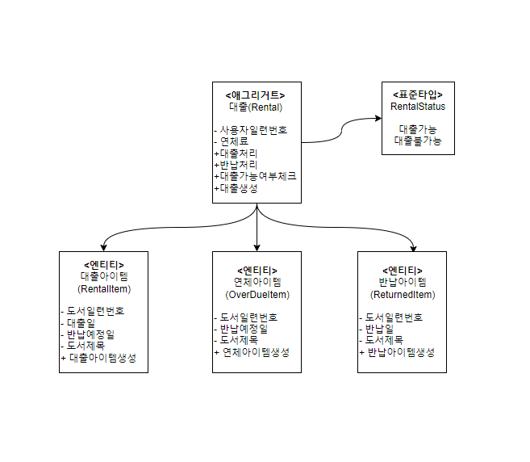

## **구현 기능 소개**

### 도서 대출

- 대출 처리에 대한 비즈니스 로직 구현
- 대출 시 도서 서비스와 연계해 상세 도서 정보(id, title) 조회(Feign을 통한 동기 호출)
- 대출 시 도서 서비스와 연계해 재고 감소 처리(카프카를 통한 비동기 메시지 전송)
- 대출 시 도서 카탈로그 서비스에 대출 도서 집계 처리(카프카를 통한 비동기 메시지 전송)

### 도서 반납

- 반납 처리에 대한 비즈니스 로직 구현
- 반납 시 도서 서비스와 연계해 재고 증가 처리(카프카를 통한 비동기 메시지 전송)

### 도서 연체

- 연체 처리에 대한 비즈니스 로직 구현
- 연체 시 대출 불가 처리

### 연체 해제

- 연체 해제를 위해 사용자 서비스와 연계해 포인트를 통해 결제 처리(Feign을 통한 동기 호출)

---

## API 설계

### 도서 대출 API

도서 대출 API는 사용자가 도서 대출을 신청할 때 호출되는 API이다. 사용자 일련번호와 대출하고자 하는 도서 일련번호가 전달되며, 사용자와 도서가 모두 대출 가능인 경우 대출이 이뤄진다. 도서 대출이 완료되는 경우 해당 사용자의 도서대출정보를 반환한다.

| API명         | 도서 대출                                                                                                      |
| ------------- | -------------------------------------------------------------------------------------------------------------- |
| 리소스 URI    | /rentals/{userId}/rentedItem/{book}                                                                            |
| 메서드        | POST                                                                                                           |
| 요청 매개변수 | 사용자 일련번호, 도서 일련번호                                                                                 |
| 요청 예시     | http://localhost:8080/rentals/5/rentedItem/10001                                                               |
| 응답 결과     | 정상 처리시 도서대출정보를 반환 <br>_ Rental 일련번호 <br>_ 사용자 일련번호 <br>_ 대출 가능 여부 <br> _ 연체료 |
| 응답 예시     | { “id” : 1, “userId” : 5, “rentalStatus” : “RENT_AVAILABLE”, “lateFee” : 0                                     |

<br>

### 도서 반납 API

대출한 도서를 반납 요청할 때 호출되는 API. 전달받은 사용자 일련번호에 해당하는 Rental을 조회해서 도서를 반납한다. 요청이 완료되면 도서 대출 기능과 마찬가지로 도서대출정보를 반환한다.

| API명         | 도서 반납                                                                                                 |
| ------------- | --------------------------------------------------------------------------------------------------------- |
| 리소스 URI    | /rentals/{userId}/rentedItem/{book}                                                                       |
| 메서드        | DELETE                                                                                                    |
| 요청 매개변수 | 사용자 일련번호, 도서 일련번호                                                                            |
| 요청 예시     | http://localhost:8080/rentals/5/rentedItem/10001                                                          |
| 응답 결과     | 정상 처리시 도서대출정보를 반환<br>_ Rental 일련번호<br>_ 사용자 일련번호<br>_ 대출 가능 여부<br>_ 연체료 |
| 응답 예시     | { “id” : 1, “userId” : 5, “rentalStatus” : “RENT_AVAILABLE”, “lateFee” : 0}                               |

<br>

### 도서 연체 처리 API

사용자가 대출한 도서를 연체아이템으로 변경할 때 호출되는 API. 대출이 완료된 도서에 한해 연체아이템으로 변경할 수 있도록 호출되기 때문에 아래 API를 호출하는 경우 연체 처리된 도서 일련번호가 반환된다. 만약 1권이라도 연체되면 사용자의 도서 대출 상태는 ‘도서대출불가’ 상태가 되며 연체료가 쌓인다.

| API명         | 도서 연체 처리                                    |
| ------------- | ------------------------------------------------- |
| 리소스 URI    | /rentals/{userId}/OverdueItem/{book}              |
| 메서드        | POST                                              |
| 요청 매개변수 | 사용자 일련번호, 도서 일련번호                    |
| 요청 예시     | http://localhost:8080/rentals/5/overdueItem/10001 |
| 응답 결과     | 연체처리된 도서 일련번호                          |
| 응답 예시     | { “bookId” : 10001}                               |

<br>

### 도서 연체 반납 API

연체된 도서 반납 API. 연체아이템을 반납했지만 연체료가 쌓였으므로 연체료를 물어야 ‘도서대출가능’ 상태를 반환한다.

| API명         | 연체아이템 반납 처리                                                                                      |
| ------------- | --------------------------------------------------------------------------------------------------------- |
| 리소스 URI    | /rentals/{userId}/OverdueItem/{book}                                                                      |
| 메서드        | DELETE                                                                                                    |
| 요청 매개변수 | 사용자 일련번호, 도서 일련번호                                                                            |
| 요청 예시     | http://localhost:8080/rentals/5/overdueItem/10001                                                         |
| 응답 결과     | 정상 처리시 도서대출정보를 반환<br>_ Rental 일련번호<br>_ 사용자 일련번호<br>_ 대출 가능 여부<br>_ 연체료 |
| 응답 예시     | {“id” : 1, “userId” : 5, “rentalStatus” : “RENT_UNAVAILABLE”, “lateFee” : 30}                             |

<br>

## 도메인 모델링



<br>

### Rental(도메인 객체)

```java
/**
 * A Rental 애그리거트 루트, 앤티티 클래스
 */
@Entity
@Table(name = "rental")
@Cache(usage = CacheConcurrencyStrategy.NONSTRICT_READ_WRITE)
@SuppressWarnings("common-java:DuplicatedBlocks")
public class Rental implements Serializable {

    private static final long serialVersionUID = 1L;

    /**
     * Rental 일련번호
     */
    @Id
    @GeneratedValue(strategy = GenerationType.IDENTITY)
    private Long id;

    /**
     * 사용자 일련번호(사용자 식별값)
     */
    @Column(name = "user_id")
    private Long userId;

    /**
     * 대 가능 여부
     */
    @Enumerated(EnumType.STRING)
    @Column(name = "rental_status")
    private RentalStatus rentalStatus;

    /**
     * 연체료
     */
    @Column(name = "late_fee")
    private Long lateFee;

    /**
     * 대출 아이템
     */
    @OneToMany(mappedBy = "rental", cascade = CascadeType.ALL, orphanRemoval = true)
    @Cache(usage = CacheConcurrencyStrategy.NONSTRICT_READ_WRITE)
    private Set<RentedItem> rentedItems = new HashSet<>();

    /**
     * 연체 아이템
     */
    @OneToMany(mappedBy = "rental", cascade = CascadeType.ALL, orphanRemoval = true)
    @Cache(usage = CacheConcurrencyStrategy.NONSTRICT_READ_WRITE)
    private Set<OverdueItem> overdueItems = new HashSet<>();

    /**
     * 반납 아이템
     */
    @OneToMany(mappedBy = "rental", cascade = CascadeType.ALL, orphanRemoval = true)
    @Cache(usage = CacheConcurrencyStrategy.NONSTRICT_READ_WRITE)
    private Set<ReturnedItem> returnedItems = new HashSet<>();

    // Rental 엔티티 생성
    public static Rental createRental(Long userId) {
        Rental rental = new Rental();
        rental.setUserId(userId); // Rental에 사용자 일련번호 부여
        rental.setRentalStatus(RentalStatus.RENT_AVAILABLE); // 대출 가능
        rental.setLateFee(0L); // 연체료 초기화
        return rental;
    }

    // 대출 가능 여부 체크
    public boolean checkRentalAvailable() throws Exception {
        if(this.rentalStatus.equals(RentalStatus.RENT_UNAVAILABLE) || this.getLateFee() != 0) {
            throw new RentUnavailableException("연체 상태입니다. 연체료를 정산 후, 도서를 대출하실 수 있습니다.");
        }

        if(this.getRentedItems().size() >= 5) {
            throw new RentUnavailableException("대출 가능한 도서의 수는 " + (5 - this.getRentedItems().size()) + "권 입니다.");
        }
        return true;
    }

    // 대출 처리 메서드
    public Rental rentBook(Long bookId, String title) {
        this.addRentedItem(RentedItem.createRentedItem(bookId, title, LocalDate.now()));
        return this;
    }

    // 반납 처리 메서드
    public Rental returnBook(Long bookId) {
        RentedItem rentedItem = this.rentedItems
            .stream()
            .filter(item -> item.getBookId().equals(bookId)).findFirst().get();
        this.addReturnedItem(ReturnedItem.createReturnedItem(
            rentedItem.getBookId(), rentedItem.getBookTitle(), LocalDate.now()
        ));
        this.removeRentedItem(rentedItem);
        return this;
    }
```

### RentedItem(대출아이템)

```java
/**
 * 대출 아이템
 */
@Entity
@Table(name = "rented_item")
@Cache(usage = CacheConcurrencyStrategy.READ_WRITE)
@SuppressWarnings("common-java:DuplicatedBlocks")
public class RentedItem implements Serializable {

    private static final long serialVersionUID = 1L;

    /**
     * 대출아이템 일련번호
     */
    @Id
    @GeneratedValue(strategy = GenerationType.IDENTITY)
    private Long id;

    /**
     * 대출한 재고 도서 일련번호(도서 서비스에서 발행한 번호)
     */
    @Column(name = "book_id")
    private Long bookId;

    /**
     * 대출 시작일자
     */
    @Column(name = "rented_date")
    private LocalDate rentedDate;

    /**
     * 반납 예정일자
     */
    @Column(name = "due_date")
    private LocalDate dueDate;

    /**
     * 대출한 도서명
     */
    @Column(name = "book_title")
    private String bookTitle;

    @ManyToOne(fetch = FetchType.LAZY)
    @JsonIgnoreProperties("rentedItems")
    private Rental rental;

    // 대출 아이템을 생성하는 메서드
    public static RentedItem createRentedItem(Long bookId, String bookTitle, LocalDate rentedDate) {
        RentedItem rentedItem = new RentedItem();
        rentedItem.setBookId(bookId);
        rentedItem.setBookTitle(bookTitle);
        rentedItem.setRentedDate(rentedDate);
        rentedItem.setDueDate(rentedDate.plusWeeks(2));
        return rentedItem;
    }
```

### OverdueItem

```java
/**
 * 연체아이템
 */
@Entity
@Table(name = "overdue_item")
@Cache(usage = CacheConcurrencyStrategy.READ_WRITE)
public class OverdueItem {

    /**
     * 연체아이템 일련번호
     */
    @Id
    @GeneratedValue(strategy = GenerationType.IDENTITY)
    private Long id;

    /**
     * 대출한 재고 도서 일련번호(도서 서비스에서 발행한 번호)
     */
    @Column(name = "book_id")
    private Long bookId;

    /**
     * 반납 예정일자
     */
    @Column(name = "due_date")
    private LocalDate dueDate;

    /**
     * 대출한 도서명
     */
    @Column(name = "book_title")
    private String bookTitle;

    @ManyToOne(fetch = FetchType.LAZY)
    private Rental rental;
```

### ReturnedItem(반납아이템)

```java
/**
 * 반납 아이템
 */
@Entity
@Table(name = "returned_item")
@Cache(usage = CacheConcurrencyStrategy.NONSTRICT_READ_WRITE)
public class ReturnedItem {

    /**
     * 반납아이템 일련번호
     */
    @Id
    @GeneratedValue(strategy = GenerationType.IDENTITY)
    private Long id;

    /**
     * 반납한 재고 도서 일련번호(도서 서비스에서 발행한 재고 도서 일련번호)
     */
    @Column(name = "book_id")
    private Long bookId;

    /**
     * 반납 일자
     */
    @Column(name = "returned_date")
    private LocalDate returnedDate;

    /**
     * 반납 도서명
     */
    @Column(name = "book_title")
    private String bookTitle;

    @ManyToOne(fetch = FetchType.LAZY)
    private Rental rental;

    public static ReturnedItem createReturnedItem(Long bookId, String bookTitle, LocalDate now) {
        ReturnedItem returnedItem = new ReturnedItem();
        returnedItem.setBookId(bookId);
        returnedItem.setBookTitle(bookTitle);
        returnedItem.setReturnedDate(now);
        return returnedItem;
    }

}
```
